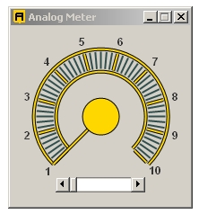



## Analog Meter 1\.0

### Description

An analog meter uses GDI.I no test in Windows Vista , but I know what this , much thing of Visual Basic 6.0 has been giving errors.
 
### More Info
 

             |
---                |---
**Submitted On**   |2008-12-13 13:28:40
**By**             |[Fernando Macedo](https://github.com/Planet-Source-Code/PSCIndex/blob/master/ByAuthor/fernando-macedo.md)
**Level**          |Intermediate
**User Rating**    |5.0 (10 globes from 2 users)
**Compatibility**  |VB 6\.0
**Category**       |[Coding Standards](https://github.com/Planet-Source-Code/PSCIndex/blob/master/ByCategory/coding-standards__1-43.md)
**World**          |[Visual Basic](https://github.com/Planet-Source-Code/PSCIndex/blob/master/ByWorld/visual-basic.md)
**Archive File**   |[Analog\_Met21370112132008\.zip](https://github.com/Planet-Source-Code/fernando-macedo-analog-meter-1-0__1-71525/archive/master.zip)

